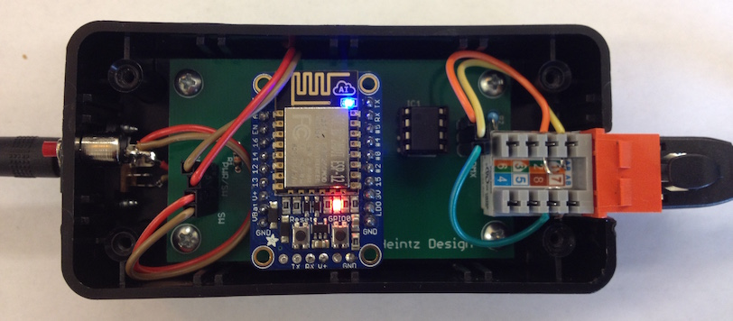

# LXDMXWiFi_library
Library for ESP8266 implements Art-Net and sACN with example sketches showing both DMX input to and DMX output from network.

LXDMXWiFi encapsulates functionality for sending and receiving DMX over an ESP8266 WiFi connection
   It is a virtual class with concrete subclasses LXWiFiArtNet and LXWiFiSACN which specifically
   implement the Artistic Licence Art-Net and PLASA sACN 1.31 protocols.
   
          
Included examples of the library's use:

         DMX input to network using UART and MAX485 driver chip

         Test of receiving two universes of DMX data from network

         DMX output from network using UART and MAX485 driver chip
            This example includes Eagle files and photos of completed project using this example
            It also includes python script for remote management of protocol/wifi settings
            
Photo shows complete WiFi to DMX unit with RJ45 connector for DMX output: (not to be confused with ethernet)
            

            
On the left side is connector for external 5v power and default boot push button.  (holding down default boot forces unit into access point mode allowing configuration via network using python tool.)
